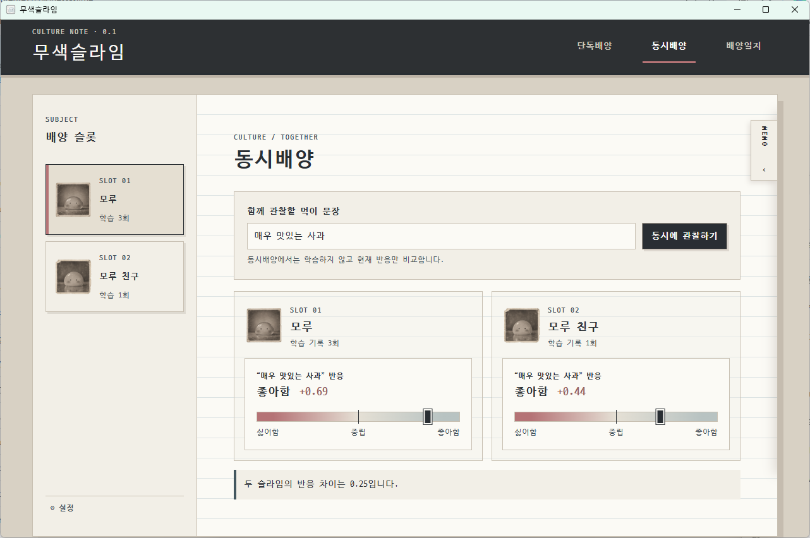
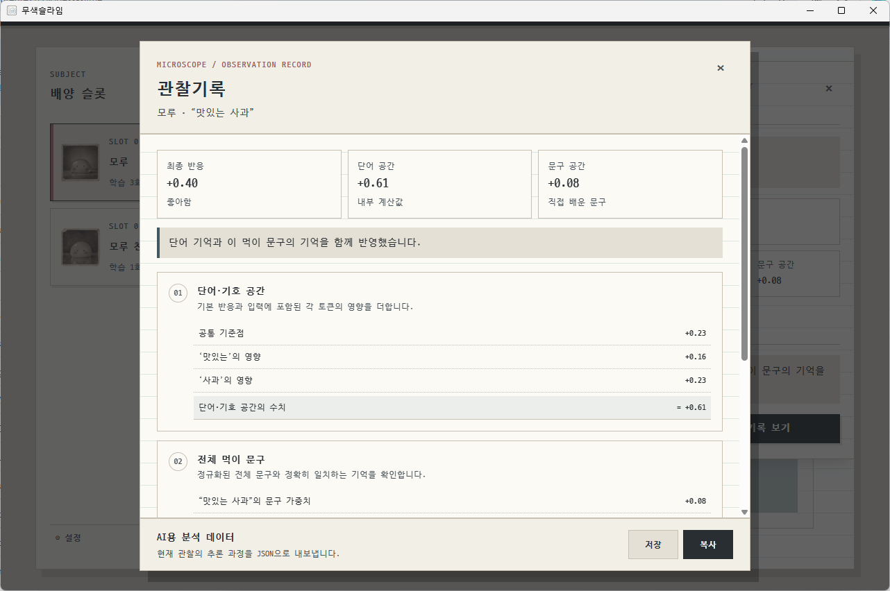

# 무색슬라임

두 마리의 작은 AI 슬라임을 서로 다르게 가르치고, 같은 문장에 보이는 반응 차이를 관찰하는 Windows 데스크톱 배양 노트입니다.

각 슬라임은 독립적인 단어·문구 기억을 가지며, 반응은 `-1`부터 `+1`까지 표시됩니다. 모든 배양 데이터는 사용자의 기기에만 저장됩니다.



## 주요 기능

- 두 개의 독립된 슬라임 슬롯
- 자유 문장을 관찰하고 원하는 반응을 가르치는 단독배양
- 같은 문장에 대한 두 슬라임의 반응을 비교하는 동시배양
- 학습 전 반응, 목표와 학습 후 반응을 남기는 배양일지
- 단어 공간·문구 공간과 최종 반응을 보여주는 현미경 기록
- 슬라임별 단어·문구 기억 배합 조정
- 전체 배양 데이터 JSON 백업과 초기화
- AI 분석용 관찰 추론 데이터 저장·복사
- 한국어·영어 인터페이스

## 관찰 과정을 자세히 보기

현미경의 관찰기록에서는 단어와 전체 문구의 영향, 내부 계산값과 최종 반응을 확인할 수 있습니다. 같은 계산 과정은 AI 분석용 JSON으로 저장하거나 클립보드에 복사할 수 있습니다.



## 데이터와 개인정보

무색슬라임 `0.1.0`은 계정, 서버 API, 원격 데이터베이스, 광고 및 분석 서비스를 사용하지 않습니다. 슬라임 이름, 입력 문장과 학습 기록은 앱의 WebView 로컬 저장소에만 보관됩니다.

직접 내보낸 백업 및 AI 분석 JSON에는 슬라임 이름과 입력 문장이 포함될 수 있습니다. 외부에 전달하기 전에 내용을 확인하세요. 자세한 내용은 [개인정보 처리 안내](PRIVACY.md)를 참고하세요.

## 소스에서 실행하기

현재 GitHub Release용 설치 파일은 게시 전입니다. 아래 방법은 소스 코드를 내려받아 직접 실행하는 개발자용 안내입니다.

### 요구 사항

- Windows 10 또는 Windows 11
- Node.js 22.13.0 이상
- Rust stable과 Cargo
- Microsoft C++ Build Tools의 `Desktop development with C++`
- Microsoft Edge WebView2 Runtime

저장소를 내려받고 JavaScript 의존성을 설치합니다.

```powershell
git clone https://github.com/ureure2/colorless-slime.git
cd colorless-slime
npm ci
```

브라우저에서 화면을 빠르게 확인합니다.

```powershell
npm run dev
```

실제 Tauri 데스크톱 앱을 실행합니다.

```powershell
npm run desktop:dev
```

처음 실행할 때는 Rust 의존성을 컴파일하므로 시간이 조금 걸릴 수 있습니다.

## 검사와 빌드

타입 검사, 회귀 검사와 웹 빌드를 한 번에 실행합니다.

```powershell
npm run verify
```

여기에 Tauri Rust 코드 검사까지 포함하려면 다음 명령을 사용합니다.

```powershell
npm run desktop:verify
```

Windows NSIS 설치 파일을 생성합니다.

```powershell
npm run desktop:build
```

설치 파일은 다음 경로에 생성됩니다.

```text
src-tauri/target/release/bundle/nsis/무색슬라임_0.1.0_x64-setup.exe
```

현재 설치 파일은 코드 서명되지 않아 Windows가 알 수 없는 게시자 안내를 표시할 수 있습니다.

## 프로젝트 구성

```text
culture-note/                 사용자용 React 앱
docs/images/                  README 화면 이미지
public/assets/                앱에서 사용하는 글꼴과 슬라임 이미지
src-tauri/                    Windows 데스크톱 및 설치 파일 구성
tests/culture-note-*.test.mjs 사용자용 앱 회귀 검사
```

이 저장소에는 사용자용 앱의 실행·검증·패키징과 공개 문서에 필요한 파일만 포함합니다.

## 보안과 라이선스

취약점 신고 방법은 [보안 정책](SECURITY.md)을 참고하세요. 실제 키, 토큰, 개인 배양 데이터는 공개 이슈에 첨부하지 마세요.

앱 소스에는 별도의 오픈소스 라이선스를 부여하지 않았습니다. 포함된 D2Coding 글꼴에는 [Open Font License](licenses/D2Coding-OFL.txt)가 적용됩니다.

---

## English

Colorless Slime is a Windows desktop culture note where you teach two small AI slimes independently and compare their reactions to the same phrase. Culture data stays in the local Tauri WebView storage. The interface supports Korean and English.

There is no packaged GitHub Release yet. To run the desktop app from source, install the prerequisites listed above and use `npm ci` followed by `npm run desktop:dev`. See [Privacy](PRIVACY.md) and [Security](SECURITY.md) before sharing exported JSON files or reporting a vulnerability.
